# Documento de Requisitos de Producto (PRD)

## Proyecto: Digitalización de Servicios Hospitalarios – Hospital de Clínicas

---

## 1. Objetivo del Producto

Desarrollar dos servicios digitales que serán alojados en los servidores del Departamento Técnico de Informática (DTI) del Hospital de Clínicas, con el fin de optimizar la gestión de documentación para pacientes y la trazabilidad del transporte en ambulancias.

---

## 2. Alcance

El proyecto abarca la construcción de dos módulos independientes pero integrables al sistema centralizado existente del hospital:

1. **Módulo de Gestión de Documentación para Pacientes**
2. **Módulo de Trazabilidad de Ambulancias**

Ambos módulos se integrarán al panel principal de acceso del hospital, permitiendo a los usuarios autenticarse con sus credenciales habituales.

---

## 3. Usuarios del Sistema

| Tipo de Usuario | Descripción |
|----------------|-------------|
| Administrativo | Personal administrativo del área de la salud que gestionará la información y operará los servicios. |
| Paciente | Usuario final que accederá a documentación e información institucional mediante códigos QR desde su dispositivo móvil. |

---

## 4. Módulo 1: Gestión de Documentación para Pacientes

### 4.1. Descripción General

Servicio que permite a un funcionario administrativo cargar y gestionar documentación digital en el servidor. Los pacientes acceden a dichos documentos escaneando un código QR desde sus dispositivos móviles, eliminando la necesidad de copias impresas.

### 4.2. Funcionalidades

#### 4.2.1. Carga y Gestión de Documentos (Funcionario Administrativo)

- Iniciar sesión mediante credenciales del sistema central del hospital.
- Cargar documentos en formato PDF (u otros formatos de documento estándar).
- Asociar metadatos a cada documento: título, descripción, categoría, fecha de publicación.
- Editar, actualizar o eliminar documentos existentes.
- Visualizar listado de documentos cargados con estado (activo/inactivo).
- Cada documento cargado genera automáticamente un código QR único.

#### 4.2.2. Acceso del Paciente mediante QR

- El paciente escanea el código QR impreso o mostrado en pantalla.
- El sistema redirige al paciente a una vista web optimizada para dispositivos móviles.
- El paciente visualiza el contenido del documento sin necesidad de descargar aplicaciones adicionales.
- No se requiere autenticación para acceder a los documentos.

#### 4.2.3. Módulo de Encuestas de Satisfacción

- Los funcionarios administrativos pueden crear y gestionar formularios de encuesta.
- Los pacientes pueden completar encuestas de satisfacción de forma digital.
- Las respuestas se almacenan en el servidor para su posterior análisis.
- El sistema permite exportar datos para cálculo de indicadores de satisfacción.

### 4.3. Documentos a Incluir (iniciales)

- Indicaciones de interrupción voluntaria del embarazo
- Prostatectomía radical (indicaciones e información para el paciente)
- Preparación para estudios imagenológicos
- Estudios diagnósticos con pertecneciato
- Centellograma de perfusión miocárdica
- Indicaciones ecocardiograma con dobutamina
- Indicaciones para pacientes en tratamiento con warfarina
- Indicaciones ecocardiograma transesofágico
- Indicaciones para ingreso a centro de nefrología y trasplante
- Plan de alta enfermería, Nefrología
- Indicaciones de enfermería para usuarios trasplantados
- Prevención de infecciones
- Encuesta de satisfacción del usuario trasplantado
- Pauta para pacientes ostomizados

### 4.4. Criterios de Aceptación

- El administrativo puede cargar un documento y obtener un código QR descargable en menos de 5 pasos.
- El paciente puede escanear el QR y visualizar el documento en su móvil sin autenticación.
- Las encuestas se almacenan persistentemente y los datos son exportables.
- El sistema funciona correctamente en los principales navegadores móviles (Chrome, Safari).

---

## 5. Módulo 2: Trazabilidad de Ambulancias

### 5.1. Descripción General

Sistema para la gestión y seguimiento del transporte realizado mediante ambulancias del Hospital de Clínicas. Permite registrar solicitudes de traslado y controlar el estado de cada operación durante todo su ciclo.

### 5.2. Funcionalidades

#### 5.2.1. Registro de Solicitudes de Traslado

El funcionario administrativo puede registrar los siguientes datos mínimos:

- **Conductor** responsable del vehículo
- **Paciente o elemento** a trasladar (puede ser paciente biológico, equipamiento médico u otros insumos)
- **Copiloto o acompañante**
- **Punto de origen**
- **Destino**
- **Hora de salida**
- **Hora estimada de llegada**
- **Hora efectiva de llegada**
- Gestión de rutas dentro del circuito nacional

#### 5.2.2. Seguimiento de Estado del Traslado

- Visualización del estado actual del traslado durante todo su ciclo operativo:
  - Pendiente
  - En curso (salida del hospital)
  - En ruta
  - Llegada a destino
  - Retorno al hospital
  - Finalizado
- Actualización manual del estado por parte del administrativo.

#### 5.2.3. Panel de Control

- Vista general de todas las ambulancias en circulación y traslados en curso.
- Histórico de traslados realizados.
- Búsqueda y filtros por fecha, conductor, paciente, estado.

### 5.3. Criterios de Aceptación

- El administrativo puede crear un traslado completo en menos de 2 minutos.
- El sistema muestra en tiempo real (o cuasi-real) el estado de cada traslado.
- Se puede consultar el histórico completo de traslados.
- Los datos persisten correctamente en el servidor.

---

## 6. Requisitos Técnicos

### 6.1. Infraestructura

- Las aplicaciones se alojarán en servidores propios del Hospital de Clínicas (DTI, piso 6).
- Se integran al sistema centralizado existente mediante accesos directos en el panel principal.
- La autenticación se realiza mediante las credenciales existentes (usuario y contraseña).

### 6.2. Stack Tecnológico (a definir con DTI)

- Compatibilidad con la infraestructura tecnológica actual del hospital.
- Frontend responsivo (optimizado para móviles en el módulo de pacientes).
- Backend con API REST para comunicación entre módulos.
- Base de datos relacional para almacenamiento persistente.

### 6.3. Seguridad

- Autenticación segura para el personal administrativo.
- Los documentos de pacientes son de acceso público vía QR (sin autenticación), pero deben protegerse contra accesos no autorizados a la gestión.
- Los datos de encuestas deben almacenarse de forma anónima o seudonimizada según normativa aplicable.

---

## 7. Restricciones y Supuestos

- El sistema centralizado existente continuará funcionando; los nuevos módulos se integran como extensiones.
- No se contempla el desarrollo de aplicaciones nativas móviles; el acceso del paciente es vía web responsiva.
- El seguimiento de ambulancias es mediante actualización manual del estado por parte del administrativo (no se requiere GPS en esta etapa).
- Los servidores del DTI tienen disponibilidad y capacidad suficientes para alojar los nuevos servicios.

---

## 8. Entregables

1. Módulo de Gestión de Documentación para Pacientes (código fuente, documentación, script de base de datos).
2. Módulo de Trazabilidad de Ambulancias (código fuente, documentación, script de base de datos).
3. Documentación de integración con el sistema centralizado.
4. Manual de usuario para administrativos.

---

## 9. Criterios de Éxito

- Reducción del presupuesto destinado a impresión de documentos informativos.
- Los pacientes acceden exitosamente a la documentación vía QR.
- Las encuestas de satisfacción tienen una tasa de respuesta medible.
- El personal administrativo puede gestionar y dar seguimiento a los traslados de ambulancia de forma eficiente.
- Los indicadores de satisfacción pueden calcularse a partir de los datos recolectados.

---

## 10. Glosario

| Término | Definición |
|---------|------------|
| DTI | Departamento Técnico de Informática del Hospital de Clínicas |
| QR | Código de respuesta rápida para acceso a información digital |
| Traslado | Operación de transporte de paciente, equipamiento o insumos vía ambulancia |
| Elemento trasladado | Puede ser paciente biológico, equipamiento médico u otros insumos |

---

> **A continuación, contenido de PRD 2.0 — Digitalización de Servicios Hospitalarios**

---

# PRD 2.0 — Digitalización de Servicios Hospitalarios

## Hospital de Clínicas

---

## 1. Visión del Producto

Modernizar la gestión hospitalaria mediante dos servicios digitales: un sistema de documentación digital con acceso vía QR para pacientes (eliminando impresiones) y un sistema de trazabilidad de ambulancias que permita controlar cada traslado en tiempo operativo.

---

## 2. Stakeholders

| Stakeholder | Rol |
|-------------|-----|
| Hospital de Clínicas | Cliente y dueño del producto |
| DTI (Departamento Técnico de Informática) | Responsable de infraestructura, hosting y mantenimiento |
| Funcionarios administrativos | Usuarios operativos de ambos módulos |
| Pacientes | Usuarios finales del módulo de documentación y encuestas |
| Conductores y personal de ambulancias | Involucrados en el módulo de trazabilidad |

---

## 3. User Personas

### Persona 1 — Administrativo (Gestión Documental)
- **Nombre:** María
- **Rol:** Funcionaria administrativa del hospital
- **Necesidad:** Cargar documentos y generar QRs sin pasos complejos
- **Dolor:** Actualmente depende de impresión y distribución física

### Persona 2 — Paciente
- **Nombre:** Carlos
- **Rol:** Paciente del hospital
- **Necesidad:** Acceder a indicaciones médicas desde su celular
- **Dolor:** Pierde papeles, no recuerda las indicaciones

### Persona 3 — Administrativo (Ambulancias)
- **Nombre:** Pablo
- **Rol:** Encargado de logística de transporte
- **Necesidad:** Saber dónde está cada ambulancia y qué traslado tiene asignado
- **Dolor:** Comunicación telefónica constante, sin registro centralizado

---

## 4. Epicas

### Épica 1: Gestión de Documentación Digital para Pacientes
**Descripción:** Sistema para que administrativos carguen documentos y pacientes los accedan vía QR.

### Épica 2: Encuestas de Satisfacción Digitales
**Descripción:** Módulo para crear y recolectar encuestas de satisfacción de pacientes.

### Épica 3: Trazabilidad de Ambulancias
**Descripción:** Sistema para registrar, gestionar y dar seguimiento a traslados en ambulancia.

---

## 5. User Stories

### Épica 1 — Gestión de Documentación Digital

**US-01:** Carga de documentos
> **Como** funcionario administrativo  
> **Quiero** cargar un documento PDF al sistema  
> **Para** que esté disponible para los pacientes vía QR

*Criterios de aceptación:*
- El sistema acepta archivos PDF de hasta 10 MB
- Al cargar, se muestra un preview del documento
- Se genera un código QR automáticamente
- El QR es descargable en formato PNG

---

**US-02:** Gestión de documentos
> **Como** funcionario administrativo  
> **Quiero** editar, desactivar o eliminar documentos existentes  
> **Para** mantener la información actualizada

*Criterios de aceptación:*
- El listado de documentos permite buscar por título y categoría
- Al desactivar un documento, su QR deja de funcionar
- Solo un administrador autenticado puede realizar estas acciones

---

**US-03:** Visualización de documento por QR
> **Como** paciente del hospital  
> **Quiero** escanear un código QR con mi celular  
> **Para** ver el documento sin necesidad de autenticarme

*Criterios de aceptación:*
- El QR redirige a una URL pública sin login
- El documento se muestra correctamente en Chrome y Safari móvil
- El contenido es legible sin hacer zoom (vista responsiva)

---

### Épica 2 — Encuestas de Satisfacción

**US-04:** Creación de encuestas
> **Como** funcionario administrativo  
> **Quiero** crear formularios de encuesta con preguntas personalizables  
> **Para** medir la satisfacción de los pacientes

*Criterios de aceptación:*
- Soporta preguntas de opción múltiple, escala numérica y texto libre
- La encuesta se asocia a un documento o es independiente
- Se genera un QR específico para la encuesta

---

**US-05:** Respuesta a encuestas
> **Como** paciente  
> **Quiero** completar una encuesta escaneando un QR  
> **Para** dar mi opinión sobre el servicio recibido

*Criterios de aceptación:*
- No requiere registro ni autenticación
- Las respuestas se guardan automáticamente al enviar
- El paciente recibe confirmación visual de envío exitoso

---

**US-06:** Análisis de resultados
> **Como** administrativo  
> **Quiero** ver los resultados de las encuestas en un dashboard  
> **Para** calcular indicadores de satisfacción

*Criterios de aceptación:*
- El dashboard muestra cantidad de respuestas por encuesta
- Los datos se pueden exportar a CSV
- Se muestran gráficos básicos (barras, torta)

---

### Épica 3 — Trazabilidad de Ambulancias

**US-07:** Registro de traslado
> **Como** funcionario administrativo  
> **Quiero** registrar una nueva solicitud de traslado con conductor, paciente, origen y destino  
> **Para** iniciar el seguimiento de la operación

*Criterios de aceptación:*
- Todos los campos obligatorios (conductor, paciente/elemento, origen, destino, hora salida)
- Se puede seleccionar conductor y acompañante desde un listado precargado
- Se genera un ID único de traslado

---

**US-08:** Actualización de estado
> **Como** funcionario administrativo  
> **Quiero** cambiar el estado del traslado (en ruta, llegó a destino, retornando, finalizado)  
> **Para** mantener el seguimiento actualizado

*Criterios de aceptación:*
- Los estados disponibles son: Pendiente, En curso, En ruta, Llegada a destino, Retorno, Finalizado
- Cada cambio de estado se registra con timestamp
- No se puede retroceder a un estado anterior

---

**US-09:** Panel de control de traslados
> **Como** administrativo encargado de logística  
> **Quiero** ver un tablero con todos los traslados activos  
> **Para** saber qué ambulancias están en circulación

*Criterios de aceptación:*
- El panel muestra: ID, conductor, destino, estado y hora de salida
- Los traslados activos aparecen destacados
- Permite filtrar por estado y fecha

---

**US-10:** Histórico de traslados
> **Como** administrativo  
> **Quiero** consultar traslados finalizados  
> **Para** generar reportes o auditorías

*Criterios de aceptación:*
- Búsqueda por fecha, conductor, paciente, ID de traslado
- Vista de detalle con línea de tiempo de cambios de estado
- Exportación a CSV o PDF

---

**US-11:** Gestión de elementos no biológicos
> **Como** administrativo  
> **Quiero** registrar traslados de equipamiento médico o insumos  
> **Para** dar trazabilidad también a elementos que no son pacientes

*Criterios de aceptación:*
- El campo "paciente o elemento" acepta texto libre
- Se puede especificar tipo: paciente, equipamiento, insumo, otro

---

## 6. Especificaciones Técnicas

### 6.1. Integración con Sistema Centralizado
- Los módulos se integran como accesos directos en el panel principal existente
- La autenticación se delega al sistema central (SSO mediante credenciales actuales)
- Las sesiones se manejan via token (JWT) proporcionado por el sistema central

### 6.2. Stack Sugerido
- **Frontend:** React o Vue.js (responsive, PWA-ready)
- **Backend:** Node.js + Express o Python + FastAPI
- **Base de datos:** PostgreSQL o MySQL
- **Generación de QR:** Librería qrcode (server-side)
- **Servidor:** Ubuntu Server + Nginx como reverse proxy

### 6.3. Seguridad
- Roles: `admin_documentos`, `admin_ambulancias`, `super_admin`
- Los documentos públicos vía QR solo permiten lectura, no listado
- Las encuestas son anónimas por defecto
- HTTPS obligatorio en todos los endpoints

---

## 7. Priorización (MoSCoW)

| Prioridad | Historias |
|-----------|-----------|
| **Must have** | US-01, US-03, US-07, US-08, US-09 |
| **Should have** | US-02, US-04, US-05, US-11 |
| **Could have** | US-06, US-10 |
| **Won't have (ahora)** | App nativa móvil, tracking GPS, notificaciones push |

---

## 8. Roadmap Tentativo

| Sprint | Historias | Entrega |
|--------|-----------|---------|
| Sprint 1 | US-01, US-03 | Carga y visualización de documentos vía QR |
| Sprint 2 | US-02, US-04 | Gestión de documentos + creación de encuestas |
| Sprint 3 | US-05, US-06 | Respuesta y análisis de encuestas |
| Sprint 4 | US-07, US-08 | Registro y estados de traslados |
| Sprint 5 | US-09, US-11 | Panel de control + elementos no biológicos |
| Sprint 6 | US-10 | Histórico, reportes, integración final |

---

## 9. Métricas de Éxito (KPIs)

- **Tasa de adopción QR:** % de pacientes que escanean vs. documentos impresos emitidos
- **Reducción de impresión:** Disminución de gasto en papel (comparativa mensual)
- **Tasa de respuesta de encuestas:** Cantidad de respuestas recibidas / total de pacientes alcanzados
- **Traslados registrados:** % de traslados documentados en el sistema vs. total realizados
- **Tiempo de registro:** Tiempo promedio que tarda un administrativo en crear un traslado

---

## 10. Riesgos y Mitigaciones

| Riesgo | Impacto | Mitigación |
|--------|---------|------------|
| Baja adopción de QR por pacientes | Alto | Campaña informativa + instrucciones impresas breves |
| Falla del servidor DTI | Alto | Backup diario + plan de contingencia |
| Resistencia del personal administrativo | Medio | Capacitación y soporte durante rollout |
| Documentos sensibles expuestos | Alto | Solo documentos de información general, sin datos personales |

---

## 11. Casos de Uso

### Módulo 1: Gestión de Documentación para Pacientes

---

**CU-01:** Iniciar sesión en el sistema
| Campo | Detalle |
|-------|---------|
| **Actor** | Funcionario administrativo |
| **Descripción** | El administrativo ingresa al sistema centralizado del hospital usando usuario y contraseña habituales |
| **Precondición** | El usuario posee credenciales activas en el sistema central |
| **Postcondición** | El usuario accede al panel principal con los módulos disponibles |
| **Flujo principal** | 1. El usuario ingresa usuario y contraseña. 2. El sistema valida las credenciales. 3. El sistema redirige al panel principal con accesos a los módulos. |
| **Flujo alternativo** | 2a. Credenciales inválidas: el sistema muestra mensaje de error y permite reintentar. |

---

**CU-02:** Cargar documento informativo
| Campo | Detalle |
|-------|---------|
| **Actor** | Funcionario administrativo |
| **Descripción** | El administrativo carga un documento PDF al servidor para que esté disponible para pacientes vía QR |
| **Precondición** | El usuario ha iniciado sesión |
| **Postcondición** | El documento se almacena en el servidor y se genera un código QR asociado |
| **Flujo principal** | 1. El usuario selecciona "Cargar documento". 2. El sistema muestra un formulario. 3. El usuario selecciona el archivo PDF y completa metadatos (título, categoría). 4. El usuario confirma la carga. 5. El sistema valida y almacena el archivo. 6. El sistema genera un código QR único. 7. El sistema muestra el QR descargable y confirma la operación. |
| **Flujo alternativo** | 5a. Archivo inválido o superior a 10 MB: el sistema rechaza la carga y muestra error. |

---

**CU-03:** Gestionar documentos existentes
| Campo | Detalle |
|-------|---------|
| **Actor** | Funcionario administrativo |
| **Descripción** | El administrativo edita, desactiva o elimina documentos previamente cargados |
| **Precondición** | El usuario ha iniciado sesión y existen documentos en el sistema |
| **Postcondición** | El documento es modificado, desactivado (el QR deja de funcionar) o eliminado |
| **Flujo principal** | 1. El usuario accede al listado de documentos. 2. El sistema muestra los documentos con su estado. 3. El usuario selecciona un documento. 4. El usuario elige editar, desactivar o eliminar. 5. El sistema confirma la acción y la ejecuta. |
| **Flujo alternativo** | 4a. Si elige eliminar, el sistema solicita confirmación adicional. |

---

**CU-04:** Visualizar documento mediante QR
| Campo | Detalle |
|-------|---------|
| **Actor** | Paciente |
| **Descripción** | El paciente escanea un código QR con su dispositivo móvil y visualiza el documento asociado |
| **Precondición** | El código QR está activo y asociado a un documento en el servidor |
| **Postcondición** | El paciente visualiza el documento en su dispositivo |
| **Flujo principal** | 1. El paciente abre la cámara de su dispositivo. 2. Escanea el código QR. 3. El sistema redirige a una URL pública. 4. El sistema muestra el documento en formato optimizado para móvil. 5. El paciente puede leer el contenido. |
| **Flujo alternativo** | 3a. QR inválido o documento desactivado: el sistema muestra mensaje "Documento no disponible". |

---

**CU-05:** Crear encuesta de satisfacción
| Campo | Detalle |
|-------|---------|
| **Actor** | Funcionario administrativo |
| **Descripción** | El administrativo crea un formulario de encuesta con preguntas personalizables |
| **Precondición** | El usuario ha iniciado sesión |
| **Postcondición** | La encuesta queda disponible con un QR propio para que los pacientes la completen |
| **Flujo principal** | 1. El usuario accede al módulo de encuestas. 2. Selecciona "Crear encuesta". 3. Completa título, preguntas y tipo de respuesta (múltiple opción, escala, texto). 4. Confirma la creación. 5. El sistema genera la encuesta y un QR asociado. |
| **Flujo alternativo** | - |

---

**CU-06:** Completar encuesta de satisfacción
| Campo | Detalle |
|-------|---------|
| **Actor** | Paciente |
| **Descripción** | El paciente escanea un QR de encuesta, responde las preguntas y envía el formulario |
| **Precondición** | La encuesta está activa y tiene un QR generado |
| **Postcondición** | Las respuestas se almacenan en el servidor para su análisis |
| **Flujo principal** | 1. El paciente escanea el QR de la encuesta. 2. El sistema muestra el formulario. 3. El paciente completa las preguntas. 4. El paciente envía el formulario. 5. El sistema guarda las respuestas. 6. El sistema muestra confirmación de envío exitoso. |
| **Flujo alternativo** | - |

---

**CU-07:** Analizar resultados de encuestas
| Campo | Detalle |
|-------|---------|
| **Actor** | Funcionario administrativo |
| **Descripción** | El administrativo accede a los resultados de las encuestas para calcular indicadores de satisfacción |
| **Precondición** | Existen encuestas con respuestas almacenadas |
| **Postcondición** | El usuario visualiza los datos y puede exportarlos |
| **Flujo principal** | 1. El usuario accede al dashboard de encuestas. 2. El sistema muestra gráficos con resultados. 3. El usuario puede filtrar por fecha o encuesta. 4. El usuario puede exportar los datos a CSV. |

---

### Módulo 2: Trazabilidad de Ambulancias

---

**CU-08:** Registrar solicitud de traslado
| Campo | Detalle |
|-------|---------|
| **Actor** | Funcionario administrativo |
| **Descripción** | El administrativo registra un nuevo traslado con los datos del conductor, paciente/elemento, acompañante, origen, destino y horas |
| **Precondición** | El usuario ha iniciado sesión |
| **Postcondición** | Se crea un traslado con ID único y estado "Pendiente" |
| **Flujo principal** | 1. El usuario accede al módulo de ambulancias. 2. Selecciona "Nuevo traslado". 3. Completa los campos: conductor, acompañante, paciente o elemento, origen, destino, hora de salida, hora estimada de llegada. 4. Confirma el registro. 5. El sistema genera un ID único y asigna estado "Pendiente". 6. El sistema confirma la operación. |
| **Flujo alternativo** | 3a. El elemento trasladado puede ser un paciente biológico, equipamiento médico u otros insumos (texto libre más tipo). |

---

**CU-09:** Actualizar estado del traslado
| Campo | Detalle |
|-------|---------|
| **Actor** | Funcionario administrativo |
| **Descripción** | El administrativo actualiza el estado del traslado durante su ciclo operativo |
| **Precondición** | Existe un traslado con estado distinto a "Finalizado" |
| **Postcondición** | El estado del traslado cambia y se registra con timestamp |
| **Flujo principal** | 1. El usuario accede al detalle del traslado. 2. El sistema muestra el estado actual. 3. El usuario selecciona el nuevo estado (En curso, En ruta, Llegada a destino, Retorno, Finalizado). 4. El sistema actualiza el estado y registra la hora del cambio. 5. El sistema confirma la actualización. |
| **Flujo alternativo** | 3a. El sistema no permite retroceder a un estado anterior. |

---

**CU-10:** Visualizar panel de control de traslados
| Campo | Detalle |
|-------|---------|
| **Actor** | Funcionario administrativo |
| **Descripción** | El administrativo consulta el tablero general con todos los traslados activos y su estado |
| **Precondición** | Existen traslados registrados |
| **Postcondición** | El usuario visualiza la información actualizada |
| **Flujo principal** | 1. El usuario ingresa al panel de control. 2. El sistema muestra la lista de traslados activos con ID, conductor, destino, estado y hora de salida. 3. El usuario puede filtrar por estado o fecha. 4. El usuario selecciona un traslado para ver más detalle. |

---

**CU-11:** Consultar histórico de traslados
| Campo | Detalle |
|-------|---------|
| **Actor** | Funcionario administrativo |
| **Descripción** | El administrativo busca traslados finalizados para auditoría o reportes |
| **Precondición** | Existen traslados finalizados en el sistema |
| **Postcondición** | El usuario obtiene los resultados de la búsqueda |
| **Flujo principal** | 1. El usuario accede al histórico. 2. Ingresa filtros de búsqueda (fecha, conductor, paciente, ID). 3. El sistema muestra los resultados. 4. El usuario selecciona un traslado para ver su línea de tiempo. 5. El usuario puede exportar los datos a CSV o PDF. |

---

**CU-12:** Gestionar rutas del circuito nacional
| Campo | Detalle |
|-------|---------|
| **Actor** | Funcionario administrativo |
| **Descripción** | El administrativo gestiona las rutas disponibles dentro del circuito nacional para asignarlas a los traslados |
| **Precondición** | El usuario ha iniciado sesión |
| **Postcondición** | La ruta se registra y queda disponible para asociar a traslados |
| **Flujo principal** | 1. El usuario accede al módulo de rutas. 2. Define o selecciona una ruta dentro del circuito nacional. 3. Asocia la ruta a un traslado existente o la guarda como disponible. 4. El sistema confirma la operación. |

---

## 12. Esquema Entidad-Relación (MER)

### 12.1. Diagrama Entidad-Relación

```mermaid
flowchart LR
    %% ESTILOS
    classDef entidad fill:#e1f5fe,stroke:#01579b,stroke-width:2px,color:#000
    classDef atributo fill:#fff9c4,stroke:#f57f17,stroke-width:1px,color:#000
    classDef relacion fill:#e8f5e9,stroke:#2e7d32,stroke-width:2px,color:#000

    %% RELACIONES
    tiene1{{tiene}}
    carga_doc{{carga}}
    cuida1{{cuida}}
    contiene1{{contiene}}
    escanea1{{escanea}}
    realiza1{{realiza}}
    genera1{{genera}}
    tiene2{{tiene}}
    lleva1{{lleva}}
    tiene3{{tiene}}
    tiene4{{tiene}}
    carga2{{carga}}

    %% ENTIDADES
    PACIENTES[PACIENTES]
    TRASLADOS[TRASLADOS]
    QR[QR]
    DOCUMENTOS[DOCUMENTOS]
    ENCUESTAS[ENCUESTAS]
    RESPUESTAS[RESPUESTAS]
    M_BIOLOGICAS[M. BIOLOGICAS]
    FUNCIONARIOS[FUNCIONARIOS]
    FC_D[FUNCIONARIOS_CARGA_DOCUMENTOS]
    AMBULANCIAS[AMBULANCIAS]
    ACOMPANANTES[ACOMPAÑANTES]
    RUTAS[RUTAS]
    EQUIPOS[EQUIPOS]

    %% ATRIBUTOS - PACIENTES
    p_ced((cedula PK))
    p_nombre((nombre))
    p_apellido((apellido))
    p_fnac((fecha_nac))
    p_tel((telefono))
    p_email((email))
    p_dir((direccion))

    %% ATRIBUTOS - TRASLADOS
    t_id((id_traslado PK))
    t_hsal((hora_salida))
    t_hlleg((hora_llegada))
    t_orig((origen))
    t_dest((destino))
    t_km((km_recorridos))
    t_est((estado))

    %% ATRIBUTOS - QR
    q_id((id_qr PK))
    q_cod((codigo))
    q_url((url))
    q_fcreac((fecha_creacion))
    q_tipo((tipo))
    q_act((activo))
    q_ced((cedula FK))

    %% ATRIBUTOS - DOCUMENTOS
    d_id((id_documento PK))
    d_nom((nom_doc))
    d_nompac((nom_pac))
    d_ced((cedula))
    d_idqr((id_qr FK))
    d_femis((fecha_emision))
    d_tipodoc((tipo_documento))

    %% ATRIBUTOS - ENCUESTAS
    e_prov((proveniencia PK))
    e_preg((preguntas))
    e_ced((cedula FK))
    e_fcreac((fecha_creacion))
    e_titulo((titulo))

    %% ATRIBUTOS - RESPUESTAS
    r_id((id_respuesta PK))
    r_graf((grafico))
    r_porc((porcentaje))
    r_prov((proveniencia FK))
    r_fresp((fecha_respuesta))
    r_coment((comentario))

    %% ATRIBUTOS - M. BIOLOGICAS
    mb_id((id_m_biologica PK))
    mb_tipo((tipo))
    mb_cuid((tipo_cuidado))
    mb_rec((receptor))
    mb_idt((id_traslado FK))
    mb_frec((fecha_recepcion))
    mb_temp((temperatura))

    %% ATRIBUTOS - FUNCIONARIOS
    f_id((id_funcionario PK))
    f_nombre((nombre))
    f_apellido((apellido))
    f_cargo((cargo))
    f_fnac((fecha_nac))
    f_ced((cedula FK))
    f_idmb((id_m_biologica FK))
    f_tel((telefono))
    f_email((email))
    f_fingreso((fecha_ingreso))

    %% ATRIBUTOS - FUNCIONARIOS_CARGA_DOCUMENTOS
    fcd_idf((id_funcionario FK))
    fcd_idd((id_documento FK))
    fcd_fcarga((fecha_carga))

    %% ATRIBUTOS - AMBULANCIAS
    a_mat((matricula PK))
    a_num((numero_coche))
    a_idt((id_traslado FK))
    a_marca((marca))
    a_mod((modelo))
    a_ano((ano_fabricacion))

    %% ATRIBUTOS - ACOMPAÑANTES
    ac_ced((cedula_acom PK))
    ac_nom((nombre))
    ac_ape((apellido))
    ac_cant((cantidad))
    ac_idt((id_traslado FK))
    ac_tel((telefono))
    ac_par((parentesco))

    %% ATRIBUTOS - RUTAS
    ru_id((id_ruta PK))
    ru_dom((domicilio))
    ru_km((km))
    ru_idt((id_traslado FK))
    ru_dur((duracion_estimada))
    ru_est((estado_trafico))

    %% ATRIBUTOS - EQUIPOS
    eq_id((id_equipo PK))
    eq_mod((modelo))
    eq_func((funcion))
    eq_tipo((tipo))
    eq_idt((id_traslado FK))
    eq_fadq((fecha_adquisicion))
    eq_est((estado))

    %% CONEXIONES ENTIDAD - ATRIBUTOS
    PACIENTES --- p_ced & p_nombre & p_apellido & p_fnac & p_tel & p_email & p_dir
    TRASLADOS --- t_id & t_hsal & t_hlleg & t_orig & t_dest & t_km & t_est
    QR --- q_id & q_cod & q_url & q_fcreac & q_tipo & q_act & q_ced
    DOCUMENTOS --- d_id & d_nom & d_nompac & d_ced & d_idqr & d_femis & d_tipodoc
    ENCUESTAS --- e_prov & e_preg & e_ced & e_fcreac & e_titulo
    RESPUESTAS --- r_id & r_graf & r_porc & r_prov & r_fresp & r_coment
    M_BIOLOGICAS --- mb_id & mb_tipo & mb_cuid & mb_rec & mb_idt & mb_frec & mb_temp
    FUNCIONARIOS --- f_id & f_nombre & f_apellido & f_cargo & f_fnac & f_ced & f_idmb & f_tel & f_email & f_fingreso
    FC_D --- fcd_idf & fcd_idd & fcd_fcarga
    AMBULANCIAS --- a_mat & a_num & a_idt & a_marca & a_mod & a_ano
    ACOMPANANTES --- ac_ced & ac_nom & ac_ape & ac_cant & ac_idt & ac_tel & ac_par
    RUTAS --- ru_id & ru_dom & ru_km & ru_idt & ru_dur & ru_est
    EQUIPOS --- eq_id & eq_mod & eq_func & eq_tipo & eq_idt & eq_fadq & eq_est

    %% CONEXIONES ENTIDAD - RELACION - ENTIDAD
    PACIENTES -- 1 --- tiene1
    tiene1 -- N --- FUNCIONARIOS

    FUNCIONARIOS -- N --- carga_doc
    carga_doc -- N --- DOCUMENTOS

    M_BIOLOGICAS -- 1 --- cuida1
    cuida1 -- N --- FUNCIONARIOS

    QR -- 1 --- contiene1
    contiene1 -- N --- DOCUMENTOS

    PACIENTES -- 1 --- escanea1
    escanea1 -- N --- QR

    PACIENTES -- 1 --- realiza1
    realiza1 -- N --- ENCUESTAS

    ENCUESTAS -- 1 --- genera1
    genera1 -- N --- RESPUESTAS

    TRASLADOS -- 1 --- tiene2
    tiene2 -- N --- AMBULANCIAS

    TRASLADOS -- 1 --- lleva1
    lleva1 -- N --- ACOMPANANTES

    TRASLADOS -- 1 --- tiene3
    tiene3 -- N --- RUTAS

    TRASLADOS -- 1 --- tiene4
    tiene4 -- N --- EQUIPOS

    TRASLADOS -- 1 --- carga2
    carga2 -- N --- M_BIOLOGICAS

    %% APLICAR ESTILOS
    class PACIENTES,TRASLADOS,QR,DOCUMENTOS,ENCUESTAS,RESPUESTAS,M_BIOLOGICAS,FUNCIONARIOS,FC_D,AMBULANCIAS,ACOMPANANTES,RUTAS,EQUIPOS entidad
    class p_ced,p_nombre,p_apellido,p_fnac,p_tel,p_email,p_dir,t_id,t_hsal,t_hlleg,t_orig,t_dest,t_km,t_est,q_id,q_cod,q_url,q_fcreac,q_tipo,q_act,q_ced,d_id,d_nom,d_nompac,d_ced,d_idqr,d_femis,d_tipodoc,e_prov,e_preg,e_ced,e_fcreac,e_titulo,r_id,r_graf,r_porc,r_prov,r_fresp,r_coment,mb_id,mb_tipo,mb_cuid,mb_rec,mb_idt,mb_frec,mb_temp,f_id,f_nombre,f_apellido,f_cargo,f_fnac,f_ced,f_idmb,f_tel,f_email,f_fingreso,fcd_idf,fcd_idd,fcd_fcarga,a_mat,a_num,a_idt,a_marca,a_mod,a_ano,ac_ced,ac_nom,ac_ape,ac_cant,ac_idt,ac_tel,ac_par,ru_id,ru_dom,ru_km,ru_idt,ru_dur,ru_est,eq_id,eq_mod,eq_func,eq_tipo,eq_idt,eq_fadq,eq_est atributo
    class tiene1,carga_doc,cuida1,contiene1,escanea1,realiza1,genera1,tiene2,lleva1,tiene3,tiene4,carga2 relacion
```

### 12.2. Descripción de Entidades

| Entidad | Atributos | Descripción |
|---------|-----------|-------------|
| **Pacientes** | cedula (PK), nombre, apellido, fecha_nac, telefono, email, direccion | Pacientes del hospital que acceden a documentación y completan encuestas |
| **Traslados** | id_traslado (PK), hora_salida, hora_llegada, origen, destino, km_recorridos, estado | Solicitudes de traslado en ambulancia registradas |
| **QR** | id_qr (PK), codigo, url, fecha_creacion, tipo, activo, cedula (FK) | Códigos QR generados para documentos o encuestas. `tipo` distingue si es de documento o encuesta; `activo` permite deshabilitar QRs expirados |
| **Documentos** | id_documento (PK), nom_doc, nom_pac, cedula, id_qr (FK), fecha_emision, tipo_documento | Documentos informativos cargados por los funcionarios, vinculados a un QR |
| **Encuestas** | proveniencia (PK), preguntas, cedula (FK), fecha_creacion, titulo | Formularios de satisfacción creados por administrativos |
| **Respuestas** | id_respuesta (PK), grafico, porcentaje, proveniencia (FK), fecha_respuesta, comentario | Respuestas recolectadas de las encuestas |
| **M. Biológicas** | id_m_biologica (PK), tipo, tipo_cuidado, receptor, id_traslado (FK), fecha_recepcion, temperatura | Muestras biológicas transportadas en los traslados |
| **Funcionarios** | id_funcionario (PK), nombre, apellido, cargo, fecha_nac, cedula (FK), id_m_biologica (FK), telefono, email, fecha_ingreso | Personal administrativo del hospital que opera los sistemas |
| **Funcionarios_carga_Documentos** | id_funcionario (FK), id_documento (FK), fecha_carga | Tabla intermedia N:N: registra qué funcionario cargó qué documento y cuándo |
| **Ambulancias** | matricula (PK), numero_coche, id_traslado (FK), marca, modelo, ano_fabricacion | Vehículos de transporte del hospital |
| **Acompañantes** | cedula_acom (PK), nombre, apellido, cantidad, id_traslado (FK), telefono, parentesco | Copilotos o acompañantes de los traslados |
| **Rutas** | id_ruta (PK), domicilio, km, id_traslado (FK), duracion_estimada, estado_trafico | Rutas del circuito nacional gestionadas para los traslados |
| **Equipos** | id_equipo (PK), modelo, funcion, tipo, id_traslado (FK), fecha_adquisicion, estado | Equipamiento médico u otros insumos transportados |

### 12.3. Relaciones

| Relación | Entidades | Cardinalidad | FK en | Descripción |
|----------|-----------|--------------|-------|-------------|
| tiene | Pacientes - Funcionarios | 1:N | Funcionarios.cedula | Un paciente puede estar asociado a varios funcionarios |
| carga | Funcionarios - Documentos | N:N | Tabla intermedia Funcionarios_carga_Documentos | Un funcionario carga varios documentos y un documento puede ser cargado por varios funcionarios |
| cuida | M. Biológicas - Funcionarios | 1:N | Funcionarios.id_m_biologica | Una muestra biológica es cuidada por varios funcionarios |
| contiene | QR - Documentos | 1:N | Documentos.id_qr | Un QR puede estar asociado a varios documentos |
| escanea | Pacientes - QR | 1:N | QR.cedula | Un paciente puede escanear varios QRs |
| realiza | Pacientes - Encuestas | 1:N | Encuestas.cedula | Un paciente puede realizar varias encuestas |
| genera | Encuestas - Respuestas | 1:N | Respuestas.proveniencia | Una encuesta genera múltiples respuestas |
| tiene | Traslados - Ambulancias | 1:N | Ambulancias.id_traslado | Un traslado tiene una ambulancia asignada |
| lleva | Traslados - Acompañantes | 1:N | Acompanantes.id_traslado | Un traslado puede llevar varios acompañantes |
| tiene | Traslados - Rutas | 1:N | Rutas.id_traslado | Un traslado tiene una o varias rutas |
| tiene | Traslados - Equipos | 1:N | Equipos.id_traslado | Un traslado puede incluir varios equipos |
| carga | Traslados - M. Biológicas | 1:N | M_Biologicas.id_traslado | Un traslado puede cargar varias muestras biológicas |

---
